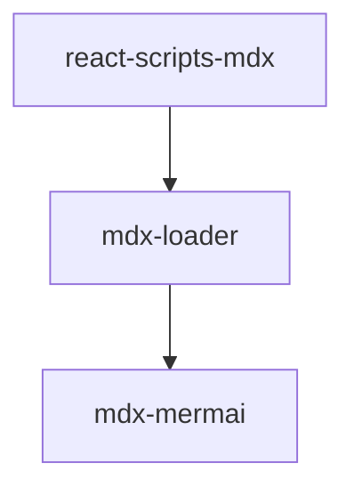

## Mermaid

[Mermaid](https://github.com/mermaid-js/mermaid)是一款用代码绘制UML图的开源库。
依赖少（纯JS），学习曲线平滑，很适合上手。再加上JS编写的跨端优势，更容易集成到其他项目中。

[Mermaid Live Editor](https://github.com/mermaid-js/mermaid-live-editor)可以在线使用。

可以简单看一下Mermaid依赖的库。用到了`d3`作为图形库，`dagre-d3`用于有向布局，`graphlib`提供数据结构存储,`khroma`用于AI智能色彩管理，`moment-mini`lite版本的momentjs，`stylis`CSS库
可以说看这几个依赖已经感觉很强了。
```json
"dependencies": {
    "@braintree/sanitize-url": "^3.1.0",
    "d3": "^7.0.0",
    "dagre": "^0.8.5",
    "dagre-d3": "^0.6.4",
    "dompurify": "2.3.1",
    "graphlib": "^2.1.8",
    "khroma": "^1.4.1",
    "moment-mini": "^2.24.0",
    "stylis": "^4.0.10"
  },
```

## 如何改造mdx-loader支持mdx-mermaid

本文不是讲如何使用Mermaid绘图，而是侧重在将其和MDX进行整合，从而优化写作体验。

下面这幅图就是mdx渲染出来的。本blog的mdx与mermaid自上而下依赖关系如下。



在实际接入过程中就遇到了挑战。

### 首先，在mdx-loader增加插件

```js
diff --git a/node_modules/mdx-loader/index.js b/node_modules/mdx-loader/index.js
index 60c954a..bc0c9a6 100644
--- a/node_modules/mdx-loader/index.js
+++ b/node_modules/mdx-loader/index.js
@@ -10,6 +10,7 @@ const mdxExportJSONByDefault = require('mdx-constant')
 const grayMatter = require('gray-matter')
 const typography = require('./typography')
 const rehypePrism = require('./prism')
 // highlight-next-line
+const mdxMermaid = require('mdx-mermaid')
 
 module.exports = async function(source) {
   let result
@@ -18,6 +19,7 @@ module.exports = async function(source) {
   const options = Object.assign(
     {
       remarkPlugins: [
           // highlight-next-line
+        mdxMermaid,
         slug,
         images, 
         emoji,

```

接入完成后，竟然ts报错了，提示`mdx-mermaid/Mermaid`不能resolve。这就很困惑了。
于是就去看node_modules，他的package.json如下

```json
"name": "mdx-mermaid",
  "version": "1.1.0",
  "description": "Display mermaid diagrams in mdx files.",
  "types": "index.d.ts",
  "main": "lib/mdxast-mermaid.js",
  "exports": {
    ".": "./lib/mdxast-mermaid.js",
    "./Mermaid": "./lib/Mermaid.js"
  },
```

首先这个mdx-mermaid包在package.json中定义了exports字段，其中将`./lib`导出成`./`,`./lib/Mermaid.js`导出成`./Mermaid`。
经过一番调查，发现[TS还没实现这个功能](https://github.com/microsoft/TypeScript/issues/33079)。

那我们就得把引用关系给改一下，接下来定位是什么地方写死的呢。

### 改造mdx-mermail

mdxast-mermaid很明显是一个babel插件，通过对代码parse再transform输出改造后的代码。

可以看到visit遍历文件，如果引入了Mermai，就不处理，否则，就增加一条import记录。问题就出在这个路径ts不认。

就改对就行了。

```js
diff --git a/node_modules/mdx-mermaid/lib/mdxast-mermaid.js b/node_modules/mdx-mermaid/lib/mdxast-mermaid.js
index dbc38e4..e9872d4 100644
--- a/node_modules/mdx-mermaid/lib/mdxast-mermaid.js
+++ b/node_modules/mdx-mermaid/lib/mdxast-mermaid.js
@@ -33,7 +33,7 @@ function plugin(config) {
         // See if there is already an import for the Mermaid component
         let importFound = false;
         unist_util_visit_1.default(ast, { type: 'import' }, (node) => {
-            if (/\s*import\s*{\s*Mermaid\s*}\s*from\s*'mdx-mermaid\/Mermaid'\s*;?\s*/.test(node.value)) {
     // highlight-next-line
+            if (/\s*import\s*{\s*Mermaid\s*}\s*from\s*'mdx-mermaid\/lib\/Mermaid'\s*;?\s*/.test(node.value)) {
                 importFound = true;
                 return unist_util_visit_1.default.EXIT;
             }
@@ -42,7 +42,7 @@ function plugin(config) {
         if (!importFound) {
             ast.children.splice(0, 0, {
                 type: 'import',
-                value: 'import { Mermaid } from \'mdx-mermaid/Mermaid\';'
 // highlight-next-line
+                value: 'import { Mermaid } from \'mdx-mermaid/lib/Mermaid\';'
             });
         }
     }


```


## patch-package的使用

一开始我说clone了两个代码库，本地通过yalc打包发布，调通。并给作者提了issue和PR

但问题是假如PR没有被合入，那如何在其他设备上同步我的“魔改”呢？

下面就要请出主角[patch-package](https://github.com/ds300/patch-package),

简单概括一下就是

1、先在node_modules里面直接修改代码

2、通过`npx patch-package 包名`的方式产生patch文件（根目录的patches文件夹下）

3、确保package.json中的postinstall存在patch应用的代码（如下）

```js
"scripts": {
    // highlight-next-line
+  "postinstall": "npx patch-package"
 }
```


上面的两处修正我都是直接在node_modules里面改的，并且fork了代码库提交了issue和PR。

感觉这样比用yalc修复bug的效率高多了呢。你觉得呢？

