## 全部模块

```mermaid
classDiagram

```

## 登录
Login
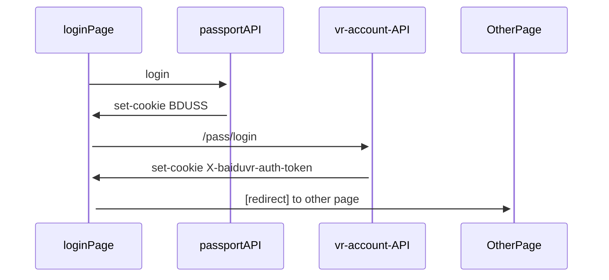
```mermaid
sequenceDiagram
     loginPage->>+passportAPI: login
    passportAPI->>+loginPage: set-cookie BDUSS
    loginPage->>+vr-account-API: /pass/login
    vr-account-API->>+loginPage: set-cookie X-baiduvr-auth-token
    loginPage->>+OtherPage: [redirect] to other page
```

Logout
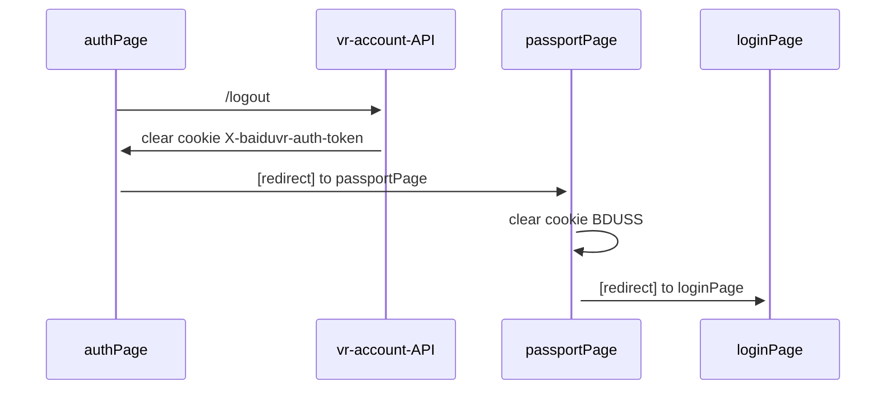
```mermaid
sequenceDiagram
    authPage->>+vr-account-API: /logout
    vr-account-API->>+authPage: clear cookie X-baiduvr-auth-token
    authPage->>+passportPage: [redirect] to passportPage
    passportPage->>+passportPage: clear cookie BDUSS
    passportPage->>+loginPage: [redirect] to loginPage
```

相关类图
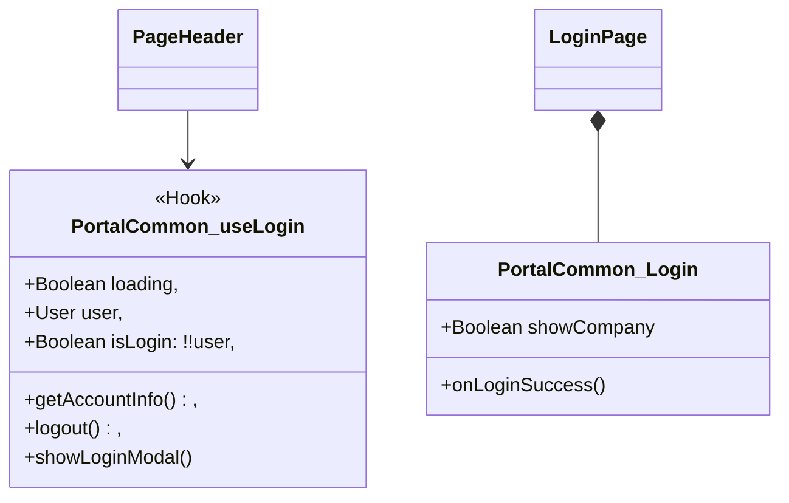
```mermaid
classDiagram


    class PageHeader {
    }

    PageHeader --> PortalCommon_useLogin

    class LoginPage{
    }

    LoginPage *-- PortalCommon_Login


    class PortalCommon_Login{
     +Boolean showCompany
     +onLoginSuccess()
    }
   
    class PortalCommon_useLogin{
	    <<Hook>>
     +Boolean loading,
     +User user,
     +Boolean isLogin: !!user,
     +getAccountInfo(),
     +logout(),
     +showLoginModal()
    }
    
```

## 开发者入驻申请

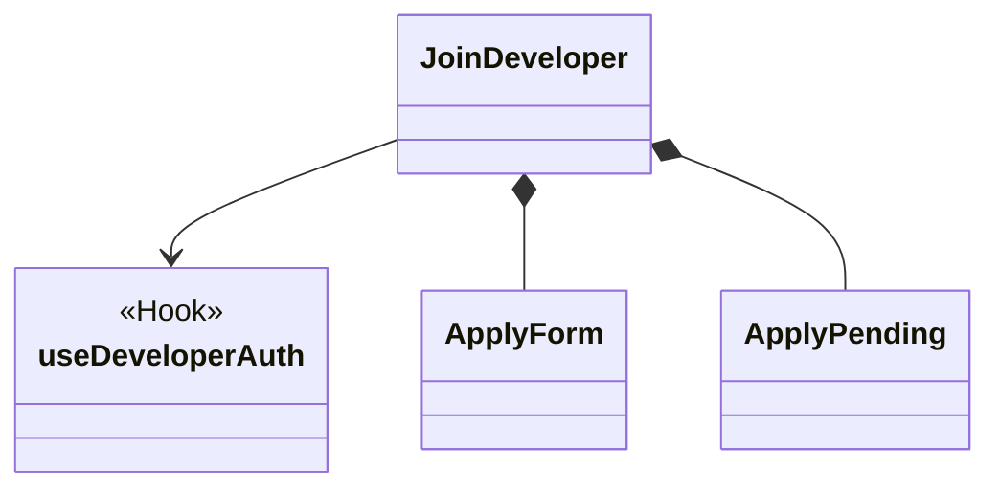
```mermaid
classDiagram
   
    class JoinDeveloper{
    }

    JoinDeveloper --> useDeveloperAuth
     JoinDeveloper *-- ApplyForm
     JoinDeveloper *-- ApplyPending
     
     class useDeveloperAuth{
	     <<Hook>>

     }

    class ApplyForm{

    }

    class ApplyPending{
         
    }
            
```

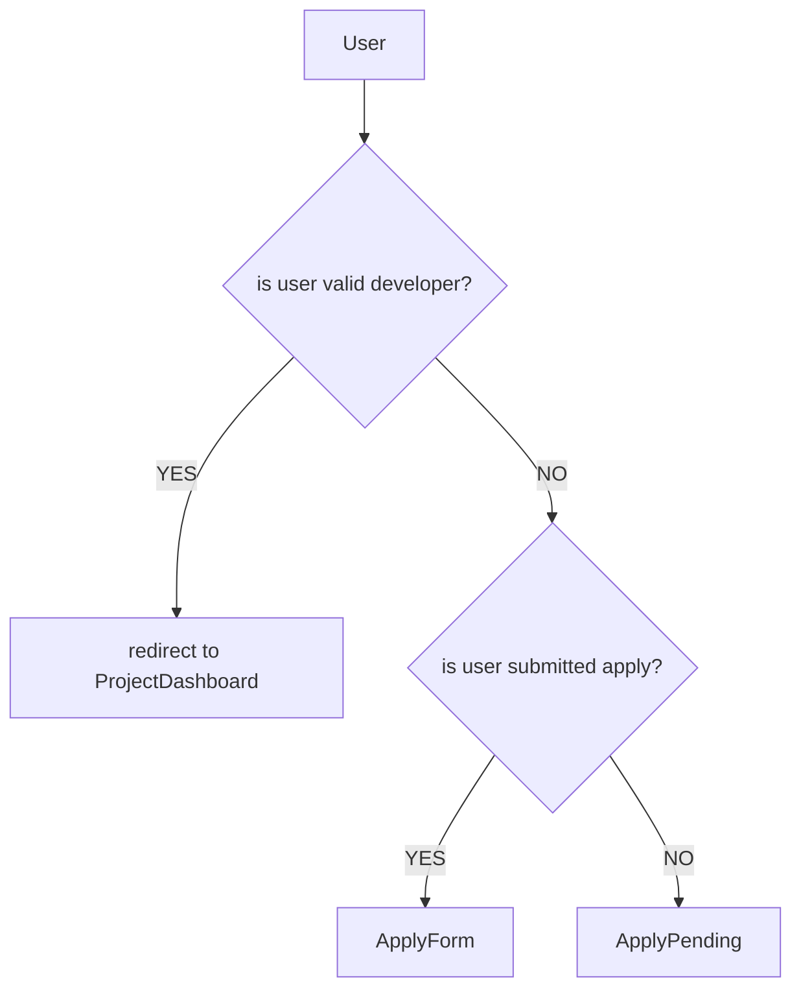
```mermaid
graph TD
   A[User] -->B{is user valid developer?}
   B --> |YES|C[redirect to ProjectDashboard]
   B --> |NO|D{is user submitted apply?}
   D --> |YES|E[ApplyForm]
   D --> |NO|F[ApplyPending]

            
```
## 测试账号管理

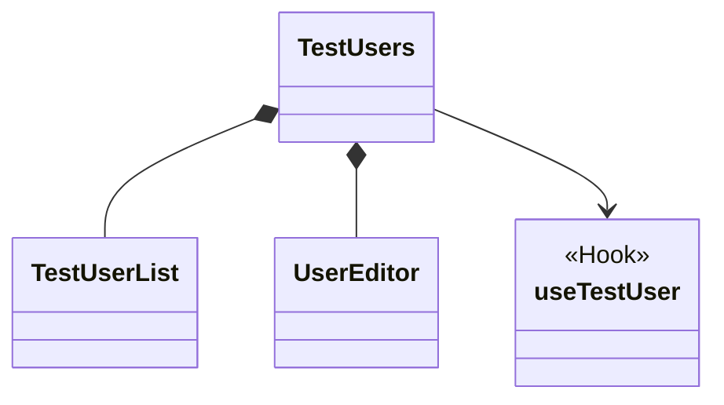
```mermaid
classDiagram
 
     
     class TestUsers {

     }

     TestUsers *-- TestUserList
     TestUsers *-- UserEditor
     TestUsers -->useTestUser

    class TestUserList{
     }
  
     class UserEditor{
     }

     class useTestUser{
	     <<Hook>>
     }

    
            
```

## 项目管理

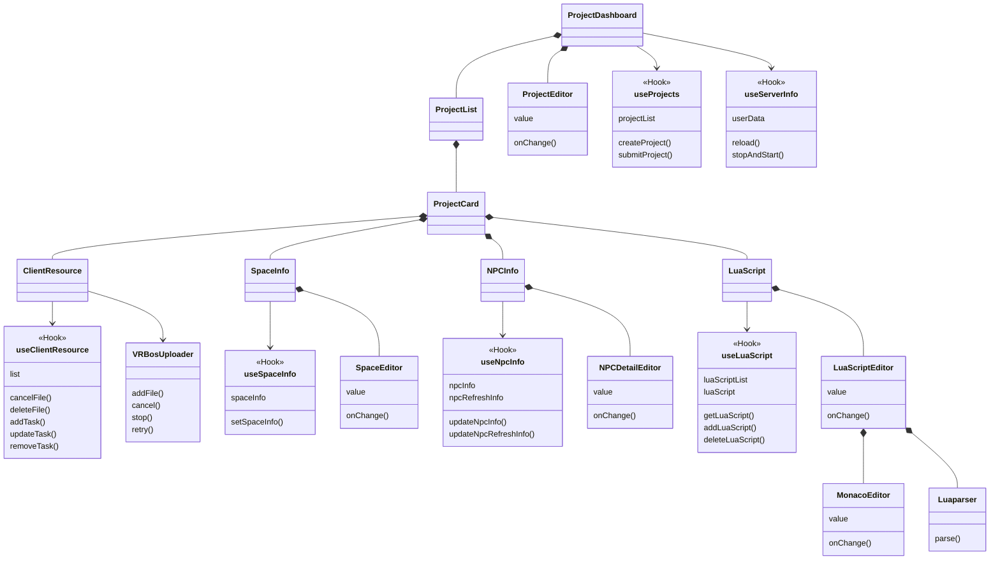
```mermaid
classDiagram
 
     ProjectDashboard *-- ProjectList

    ProjectDashboard *-- ProjectEditor
    class ProjectDashboard{
    }

    class ProjectEditor{
	value
	onChange()
    }

    ProjectDashboard --> useProjects
    ProjectDashboard --> useServerInfo

    class useProjects{
	<<Hook>>
	createProject()
	projectList
	submitProject()
    }
  
     class ProjectList{
       
    }
    ProjectList *-- ProjectCard

    class ProjectCard{
       
    }
    
     ProjectCard *-- ClientResource
     ProjectCard *-- SpaceInfo
     ProjectCard *-- NPCInfo
     ProjectCard *-- LuaScript
    

    class useServerInfo{
	<<Hook>>
	userData
	reload()
	stopAndStart()
    }
    
     

    class ClientResource{
    }
    ClientResource --> useClientResource
    ClientResource --> VRBosUploader

    class VRBosUploader{
	addFile()
	cancel()
	stop()
	retry()
    }

    class useClientResource{
	<<Hook>>
	list
	cancelFile()
	deleteFile()
	addTask()
	updateTask()
	removeTask()
    }

    class SpaceInfo{
         
    }
    SpaceInfo --> useSpaceInfo

    class useSpaceInfo{
	<<Hook>>
	spaceInfo
	setSpaceInfo()
    }

    SpaceInfo *-- SpaceEditor

    class SpaceEditor{
	    value
	    onChange()
    }

    class NPCInfo{
    }

    NPCInfo --> useNpcInfo

    class useNpcInfo{
	    <<Hook>>	    
	    npcInfo
	    npcRefreshInfo
	    updateNpcInfo()
	    updateNpcRefreshInfo()
    }

    NPCInfo *-- NPCDetailEditor

    class NPCDetailEditor{
	    value
	    onChange()
    }


    class LuaScript{
    }

    LuaScript --> useLuaScript

    class useLuaScript{
	<<Hook>>
	luaScriptList
	luaScript
	getLuaScript()
	addLuaScript()
	deleteLuaScript()
    }

    LuaScript *-- LuaScriptEditor

    class LuaScriptEditor{
	    value
	    onChange()
    }

    LuaScriptEditor *-- MonacoEditor
    LuaScriptEditor *-- Luaparser

    class MonacoEditor{
	value
	onChange()
    }

    class Luaparser{
	parse()
    }
```

服务器管理

确保服务器处于开启状态
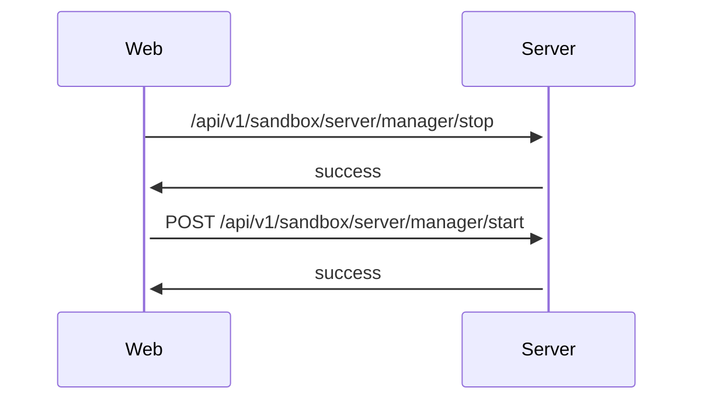
```mermaid
sequenceDiagram
    Web->>+Server: /api/v1/sandbox/server/manager/stop
    Server->>+Web: success
    Web->>+Server: POST /api/v1/sandbox/server/manager/start
     Server->>+Web: success
```

创建项目
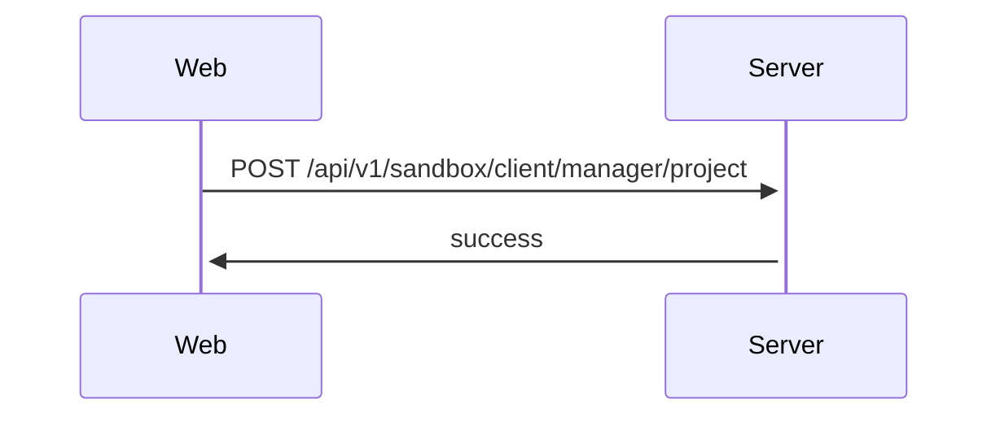
```mermaid
sequenceDiagram
    Web->>+Server: POST /api/v1/sandbox/client/manager/project
    Server->>+Web: success
```

### LuaScript
查询脚本列表
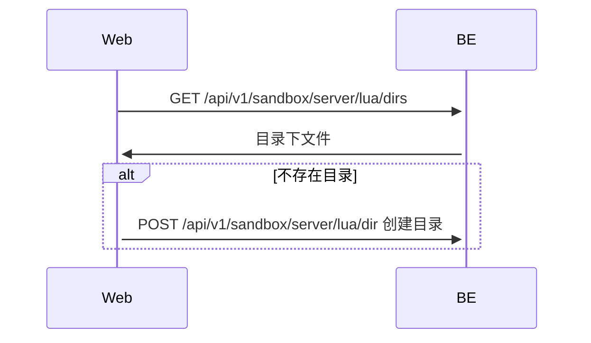
```mermaid
sequenceDiagram
    Web->>+BE: GET /api/v1/sandbox/server/lua/dirs
    BE->>+Web: 目录下文件
    alt 不存在目录
        Web->>BE: POST /api/v1/sandbox/server/lua/dir 创建目录
    end
            
```
打开脚本详情
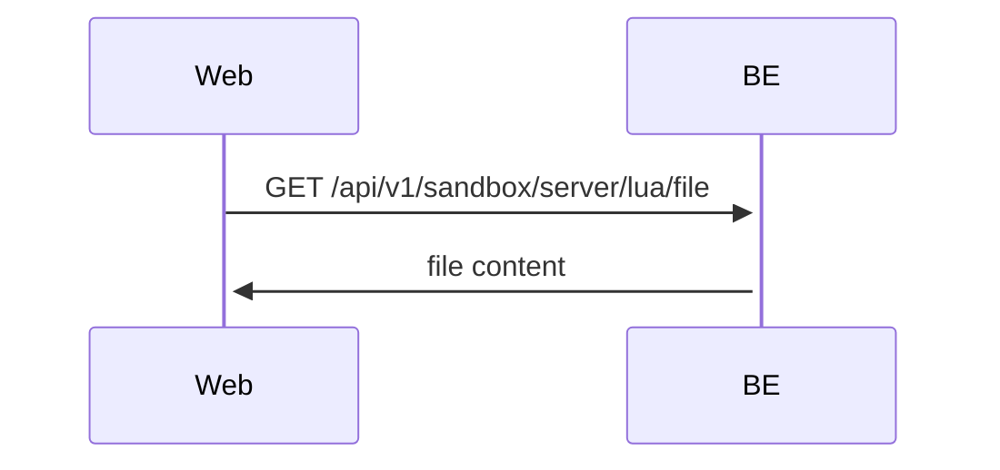
```mermaid
sequenceDiagram
    Web->>+BE: GET /api/v1/sandbox/server/lua/file
    BE->>+Web: file content
```

保存脚本
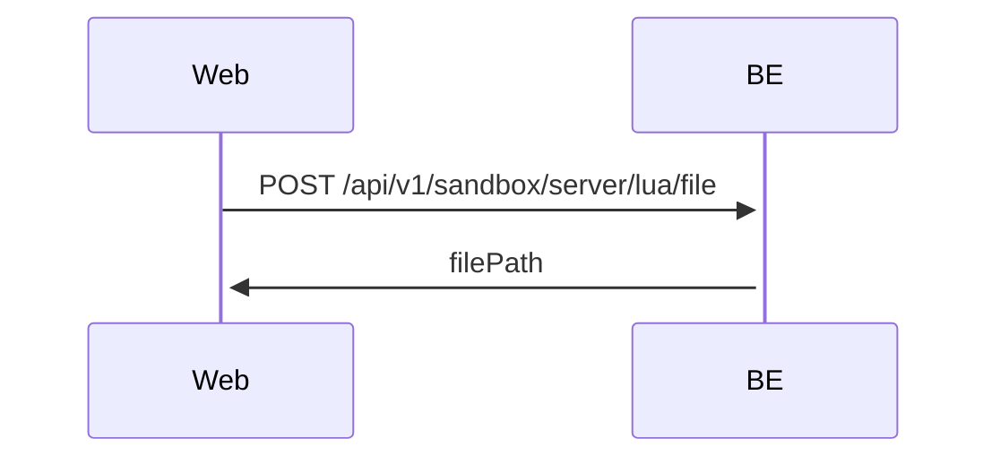
```mermaid
sequenceDiagram
    Web->>+BE: POST /api/v1/sandbox/server/lua/file
    BE->>+Web: filePath
```

删除脚本、编辑保存
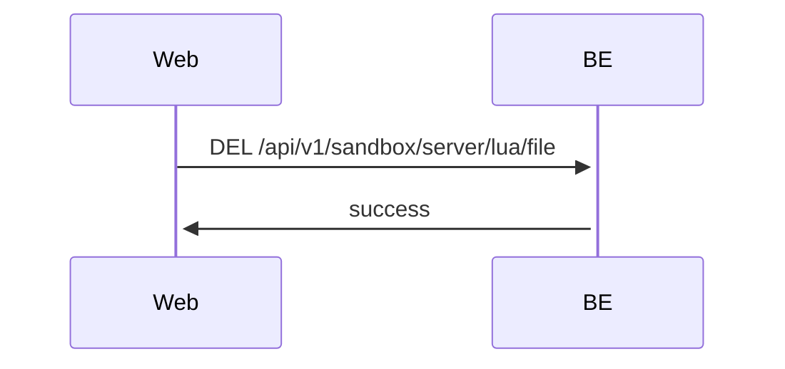
```mermaid
sequenceDiagram
    Web->>+BE: DEL /api/v1/sandbox/server/lua/file
    BE->>+Web: success
   
```