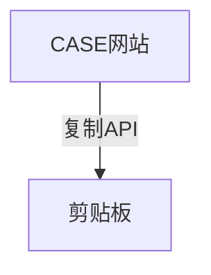
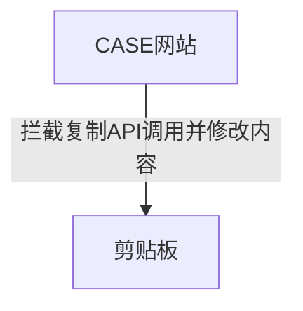
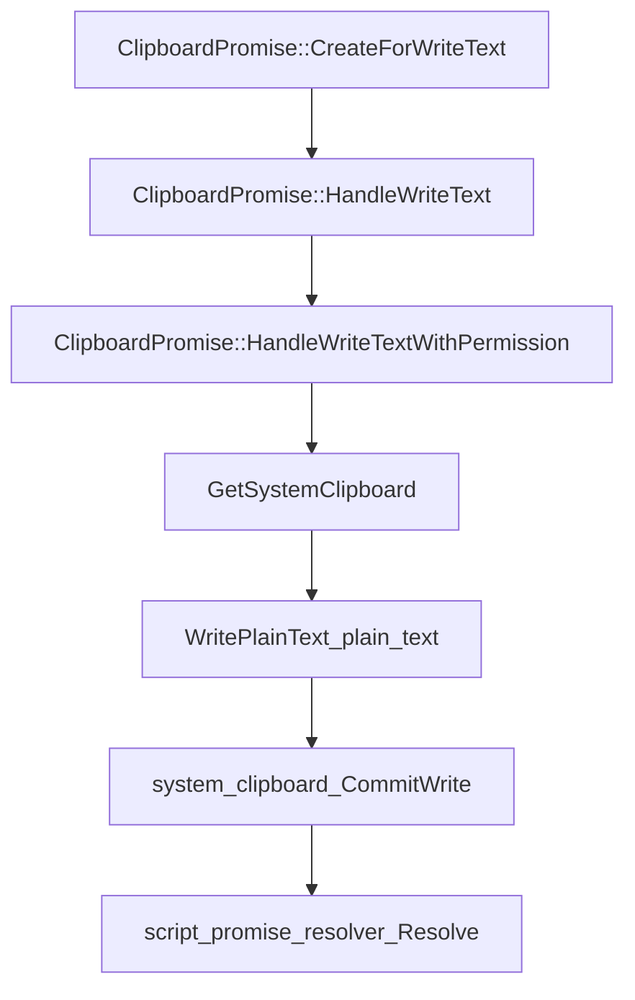

## 你可以从本文了解到

### iCopy 背景

[iCopy](https://greasyfork.org/zh-CN/scripts/411953-icopy5)是一个用于 Chrome 浏览器的 js 插件，主要用于帮助开发者在某些 CASE 网站中方便的复制和格式化 git commit msg。

原先的 CASE 复制工作流程如下



然鹅，由于 CASE 网站复制的格式不符合 git 的要求，比如我们遵循 angular 的规范，那就需要改这个 msg，这时候 iCopy 就上场了。

用了 iCopy 的工作流程



说白了就是做剪贴板的拦截。

CASE 网站将内容复制到剪贴板，常用的一般有两种方法。

1、[execCommand](https://developer.mozilla.org/en-US/docs/Web/API/Document/execCommand) 旧的，MDN 不推荐使用

2、[Clipboard API](https://developer.mozilla.org/en-US/docs/Web/API/Clipboard_API) 新版本 CASE 网站调用

### execCommand vs clipboard API

所以可以推测因为 execCommand 接口不推荐使用了，所以 CASE 网站改造成了用 Clipboard API。

那 clipboard API 有什么好处呢？

直观的可以感受一下两段代码

```js
// execCommand
export default function copyToCb(text) {
    const input = document.createElement('textarea');
    input.setAttribute('readonly', 'readonly');
    input.value = text;
    document.body.appendChild(input);
    input.select();
    input.setSelectionRange(0, 9999);
    document.execCommand('copy');
    document.body.removeChild(input);
    return Promise.resolve();
}
```

```js
// clipboard API
var promise = navigator.clipboard.writeText(newClipText);
```

代码量出现了肉眼可见的下降。

此外，clipboard返回的是promise，解锁了更现代的调用方式。

#### 拦截 execCommand 的姿势

```js
const _execCommand = document.execCommand; // 原方法

// 劫持
document.execCommand = async function (evtName) {
    if (evtName === 'copy') {
        console.log('enter exec');
        // 由于前者使用必须要selection然后exec copy
        // 获取选中部分
        const text = window.getSelection().toString();
        main(text); // 格式化text并最终调用了copyText
    }
};

const copyText = (text) => {
    const el = document.createElement('textarea');
    el.value = text;
    document.body.appendChild(el);
    el.select();
    _execCommand('copy'); // 调用原方法
    document.body.removeChild(el);
    console.log('copied:', text);
};
```

execCommand 比较清晰就不解释了。

#### 拦截 clipboard API 的姿势

```js
const _writeText = navigator.clipboard.writeText; // save for later use

const copyText = (text) => {
    // this得指向navigator.clipboard实例
    _writeText.call(navigator.clipboard, text);
};
```

writeText 劫持这里有一个坑，就在于如果直接使用，会报错，大致内容是typeError找不到Clipboard.navigator.clipboard.writeText的这个方法

```js
_writeText(text);
```

这比较让人费解，为什么会是Clipboard的的writeText方法呢？为什么是typeError呢？

这就不得不研究一下这个方法究竟在做什么。

首先打开[Chromium的clipboard部分源码](https://source.chromium.org/chromium/chromium/src/+/main:third_party/blink/renderer/modules/clipboard/clipboard.cc;l=53?q=CreateForWriteText&ss=chromium%2Fchromium%2Fsrc)

```cpp
ScriptPromise Clipboard::writeText(ScriptState* script_state,
                                   const String& data) {
  return ClipboardPromise::CreateForWriteText(GetExecutionContext(),
                                              script_state, data);
}

// static
ScriptPromise ClipboardPromise::CreateForWriteText(ExecutionContext* context,
                                                   ScriptState* script_state,
                                                   const String& data) {
  if (!script_state->ContextIsValid())
    return ScriptPromise();
  ClipboardPromise* clipboard_promise =
      MakeGarbageCollected<ClipboardPromise>(context, script_state);
  clipboard_promise->GetTaskRunner()->PostTask(
      FROM_HERE, WTF::Bind(&ClipboardPromise::HandleWriteText,
                           WrapPersistent(clipboard_promise), data));
  return clipboard_promise->script_promise_resolver_->Promise();
}

void ClipboardPromise::HandleWriteTextWithPermission(PermissionStatus status) {
  DCHECK_CALLED_ON_VALID_SEQUENCE(sequence_checker_);
  if (!GetExecutionContext())
    return;
  if (status != PermissionStatus::GRANTED) {
    script_promise_resolver_->Reject(MakeGarbageCollected<DOMException>(
        DOMExceptionCode::kNotAllowedError, "Write permission denied."));
    return;
  }
 // highlight-next-line
  SystemClipboard* system_clipboard = GetLocalFrame()->GetSystemClipboard();
  system_clipboard->WritePlainText(plain_text_);
  system_clipboard->CommitWrite();
  script_promise_resolver_->Resolve();
}

```

稍微梳理了一下调用关系



流程比较清晰，我们重点关注这个GetLocalFrame()方法。因为问题就出在[这个文件](https://source.chromium.org/chromium/chromium/src/+/main:third_party/blink/renderer/core/frame/local_frame.cc;l=2628)

这里发生了一个强转，将this转成了`system_clipboard_`，所以错误提示显示的是typeError（cpp的部分出错了）。而不是js的错误（js根本没有type这个词汇）。

看了这个代码之后，我很清楚，只要在调用的时候确保this是正确的clipboard的实例就行了。

那么谁才是clipboard的实例呢？答案是`navigator.clipboard`。

题外话：浏览器全局对象里面有一个Clipboard，他是这个实例的构造函数，host在适当的时候会创建它的实例（lazy）

此外，有同学就会问了，那么为什么`execCommand`不报错呢？
主要是默认的this指向了window，而execCommand内部

```js
contentWindow.document.execCommand
```

### gist 的实用小技巧

我们的脚本用git的gist发布和管理，那么获取一个固定的raw文件url呢。

我们可以用下面这个地址访问哈。
`https://gist.githubusercontent.com/[username]/[gist_id]/raw/[filename]`